# Flujo básico en Git. Local.

En esta práctica comenzarás a trabajar en Git. Crearás un repositorio vacío al que le añadirás un fichero con cuatro commits: 

- Crear repositorio 
- Añadir seguimiento del archivo 
- Commit del archivo
   1. Mi nombre 
   2. Mi correo 
   3. Mis hobbies 
   4. Mi imagen 

Sigue paso a paso, responde y adjunta pantallazos en este README.md

1. Crea un directorio/carpeta vacía con el nombre de esta práctica.
   1. Abre git bash en un directorio/carpeta vacía (menú contextual).
   2. Ejecuta git sin argumentos. Mostrará los comandos básicos git.  Indica los distintos apartados.

   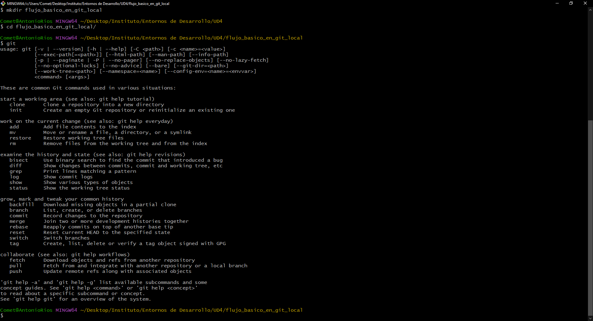

   Enseña una lista con los comandos básicos como Configuración, creacion de repositorios ...

Trabajar con ramas
   3. Ejecuta git status y git log antes de crear ningún repositorio. Explica lo mostrado. 
   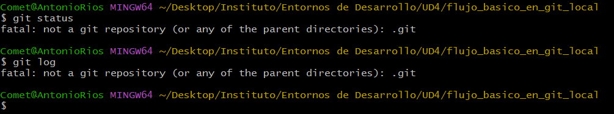

   Git log dice que no hay commits y git status dice que no hay directorios en la carpeta

2. Crea un repositorio vacío

   1. Muestra el contenido del directorio .git (dir .git)
   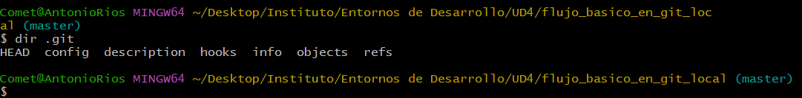

   2. Ejecuta git status y git log. Indica la rama sobre la que trabajas y explica lo mostrado. git status
   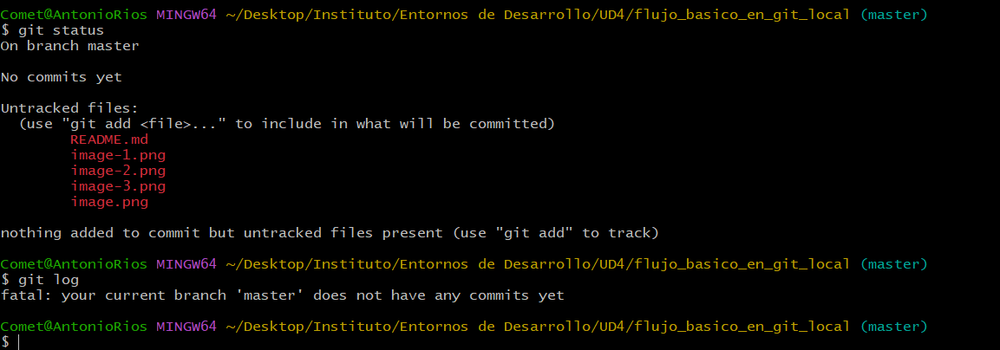

   El git status dice que estoy en la rama "master" y el git log dice que no la rama "master" no tiene commits aún.

   3. Crea el fichero sobremi.html. Añade tu nombre y apellidos en un elemento de una lista

   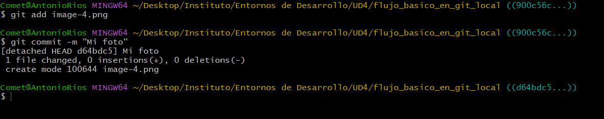

   1. Muestra el estado del directorio de trabajo. Explica lo mostrado git status

   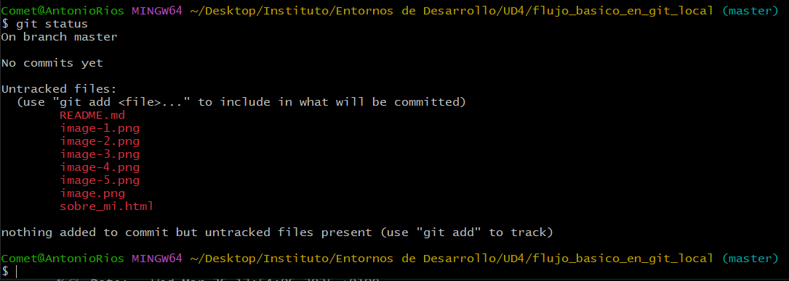
   Dice que no se ha añadido ningun commit pero que hay archivos que no están siendo seguidos?

3. Ejecuta git diff y git diff --staged git diff

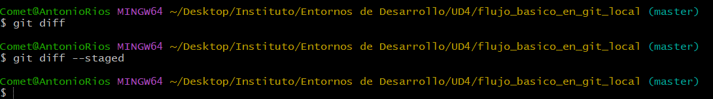

No dice nada creo que porque no ha cambiado nada.

   1. Añade el cambio al repositorio con git add

   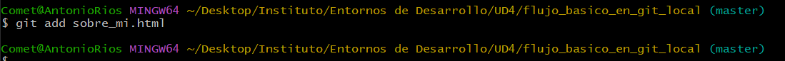

   2. Ejecuta git diff y git diff --staged git diff
   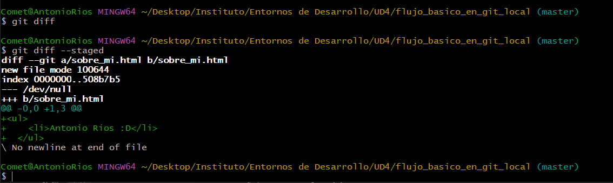

   3. Confirma el cambio al repositorio git commit con el mensaje "mi nombre" git commit

   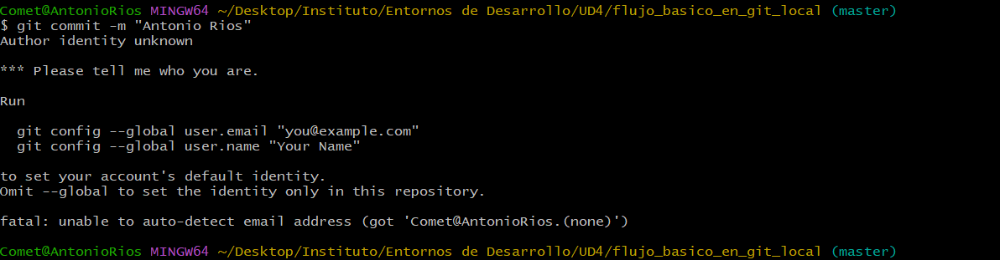

   4. Ejecuta git diff y git diff --staged
   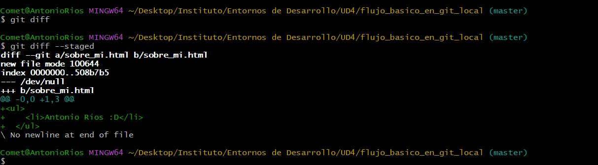

5. Añade tu correo electrónico

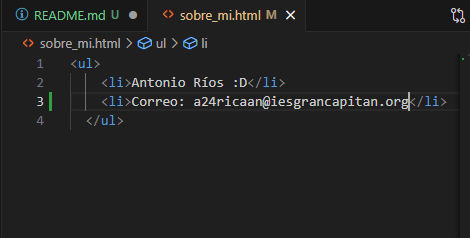

   1. Ejecuta git diff y git diff --staged git diff
   
   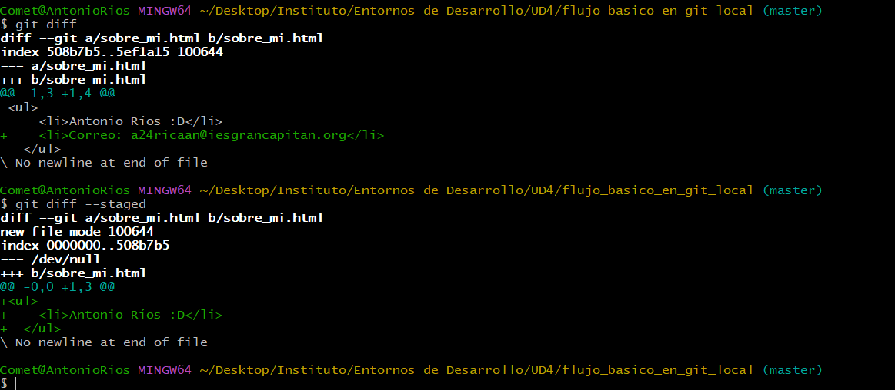

   2.  Añade el cambio al repositorio git commit -a con el mensaje "mi correo" git commit

   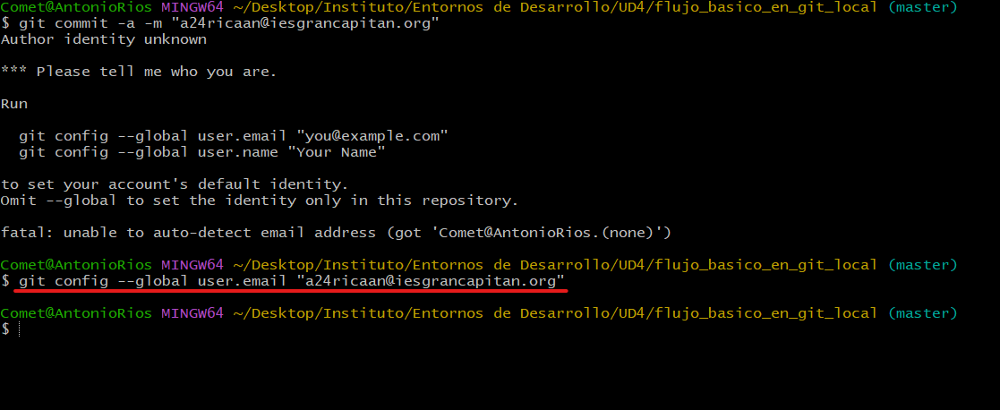

   3.  Ahora tienes dos commits. Vuelve al estado anterior mediante git checkout HEAD^ 

   
   
6.  Abre el editor para mostrar el nuevo estado del directorio de trabajo git status

   1.  Vuelve al estado con nombre y correo mediante git checkout sha-1

   

    No se porque no me funciona
    
7.  Abre el editor para mostrar el nuevo estado del directorio de trabajo.
   1.  Indica el cambio git status 
6. Añade tus hobbies con el mensaje "mis hobbies" en el commit git commit
7. Añade una imagen tuya con el mensaje "mi imagen" en el commit git commit
   

   De  interés:
   - [2. Fundamentos de Git](https://git-scm.com/book/es/v2/Fundamentos-de-Git-Obteniendo-un-repositorio-Git)
